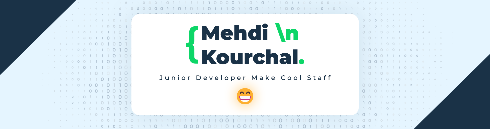

  

  <h3>Junior Developer Making Cool Stuff 🚀</h3>
  
  

    Building automations, bots, and dynamic web applications. 
     Passionate about learning and creating stunning user interfaces.
  

  

    
    
    
  

---

### 👨‍💻 About Me

- 🔭 I’m currently building automations, bots, and web applications like **Aninga** (Anime and Manga Downloader) and **ista** server projects.
- 🌱 I’m continuously learning and honing my skills in **React, Next.js, and Laravel**.
- 💡 Proficient in crafting responsive UI/UX with **HTML, CSS, Tailwind CSS, and Angular**.
- 🐍 Experienced in **Python Object-Oriented Programming (OOP)**.
- 📫 How to reach me: Connect with me on [LinkedIn](https://linkedin.com/in/mehdi-kourchal-70495427b) or check out my [Portfolio](https://www.kourchal.com)!

### 🛠️ Tech Stack & Tools

  

### 📊 GitHub Activity & Stats

  
  

---

  <i>Let's keep coding and building amazing things! 🛠️</i>

